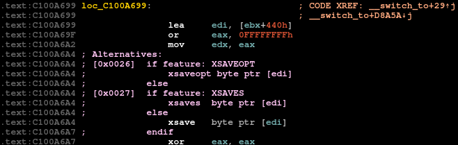
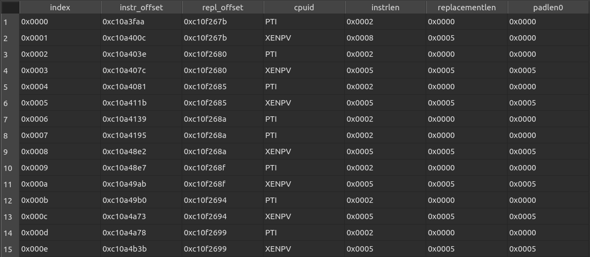

About
=====

This is an IDA Pro (Interactive Disassembler) plugin allowing to automatically analyze and annotate Linux kernel alternatives (content of `.altinstructions` and `.altinstr_replacement` sections).

Requirements
============

This is an IDAPython-based plugin supporting IDA Pro 7.x with Python 3.

Currently only `x86/x86_64` architecture is supported.

Installation
============

## System-wide installation:

Copy `linux_alternatives.py` file into your `IDADIR/plugins` directory:

| OS      | Typical global plugins directory path       |
| ------- | ------------------------------------------- |
| Windows | `%ProgramFiles%\IDA Pro 7.x\plugins`       |
| macOS   | `/Applications/IDA Pro 7.x/idabin/plugins`  |
| Linux   | `/opt/idapro-7.x/plugins`                   |

Where `x` should be the actual version number installed.

## User installation:

Copy `linux_alternatives.py` file into your local user IDA plugins directory:

| OS          | Typical user plugins directory path  |
| ----------- | ------------------------------------ |
| Windows     | `%AppData%\Hex-Rays\IDA Pro\plugins` |
| Linux/macOS | `~/.idapro/plugins`                  |

Usage
=====

To use the plugin click `Linux Alternatives` entry from the `Edit / Plugins` menu bar. Alternatively, invoke the plugin with a shortcut `Alt + F9`.

The plugin also registers three additional options (available from `Edit / Linux Alternatives` menu bar):

* `Import cpufeatures.h file` - This option opens up a file chooser allowing to specify a `cpufeatures.h` file corresponding to the kernel being analyzed.

* `Remove alternative comments` - This option closes the `Alternatives` window and removes all annotations from the database. **Note**: This option appears only after the annotations are applied.

* `Patch selected alternatives` - This option allows to specify a comma-separated list of CPU feature flags and patch into binary corresponding alternatives. **Note: after providing the list of feature flags, the corresponding alternatives are automatically patched in. No need to re-run the plugin.**

What does it do?
================

The plugin performs the following steps upon invocation:

### 1. **Obtain the memory layout of `struct alt_instr`:**
   * If DWARF-based definition of the structure is available, it is used directly.
   * Otherwise, the plugin heuristically determines:
      - type (and size) of the first two structure members (address or relative offset of instruction and replacement).
      - size of the structure
      - offset of the length field members   

### 2. **Obtain available CPUFEATURE and X86_BUGS flag names**
   * Analyze string references in: `x86_cap_flags` and `x86_bug_flags` array symbols.
   * If `cpufeatures.h` file has been loaded, the plugin parses it and uses CPUFEATURE and X86_BUGS flags from it.

### 3. **Analyze and annotate content of `.altinstructions` and `.altinstr_replacement` sections**

`.altinstructions`                              | `.altinstr_replacement`
:----------------------------------------------:|:----------------------------------------------------:
 | 

### 4. **Apply alternatives comments in the disassembly for all alternative entries found**   

### 5. **Open a new window with a tabular listing of the alternatives**
   * columns are sortable and addresses clickable   

Patching alternatives
=====================

Main purpose of this feature is to simulate presence of specified CPU feature flags and update binary with their corresponding alternatives for static analysis purposes. This feature might be helpful for inspecting alternative entries for correctness and security, without the need to run the Linux kernel binary.

Upon clicking the `Patch selected alternatives` option in `Edit / Linux Alternatives` menu bar, the following prompt is displayed:     
User can specify comma-separated list of feature flags either by their name (case insensitive) or by their integer value as calculated in typical `cpufeatures.h` file:   

Clicking `OK` will automatically patch and re-analyze the entire database with alternatives selected with the feature flags:

Before                      | After
:--------------------------:|:---------------------------:
 | 
